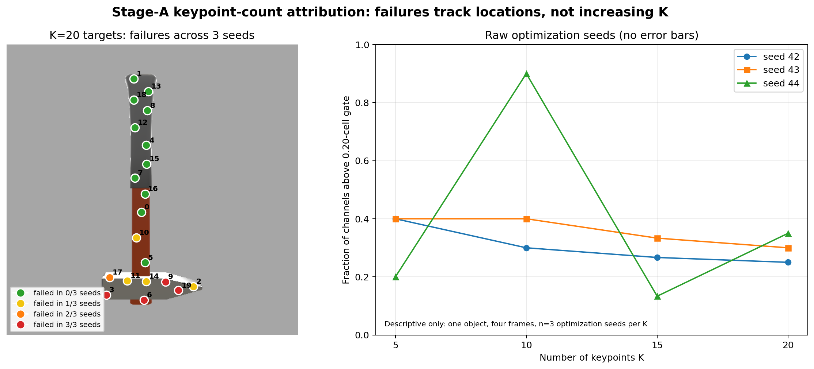

# Stage-A Keypoint-Count Sweep Results (2026-07-05)

## Verdict

Changing the number of keypoints from 5 to 20 did **not** produce a monotonic
increase in failure rate. The strict all-channel gate failed for every run, but
the failures repeatedly occurred at the same assigned physical targets,
concentrated on the hammer head. Keypoint count is therefore not the primary
explanation for the failed K=10 control.

This does not yet distinguish a numerical channel-index bug from a difficult
target/location plus coordinate-readout interaction, because target identity
and output-channel index were not permuted in this sweep.

## Frozen design

- K: 5, 10, 15, 20.
- Optimization seeds: 42, 43, 44.
- Four fixed frames: 0, 3, 6, 9.
- 5,000 updates per run.
- Standard native 64x64 heatmaps only.
- Gate: median channel error <= 0.10 cell64 and every channel <= 0.20 cell64.
- All 12 completed result artifacts are present. One initial cluster task failed
  before Python because `gcc` was temporarily unavailable; its replacement job
  completed with exit code 0 and supplied the missing K=20, seed-43 artifact.

## Results

| K | runs passing all-channel gate | median failed-channel fraction | median worst-channel error (cell64) | targets failing in all 3 seeds |
|---:|---:|---:|---:|---|
| 5 | 0/3 | 0.400 | 4.396 | 3 |
| 10 | 0/3 | 0.400 | 4.396 | 3, 6, 9 |
| 15 | 0/3 | 0.267 | 3.370 | 3, 6 |
| 20 | 0/3 | 0.300 | 5.007 | 3, 6, 9, 19 |

The raw failed fractions were:

- K=5: 0.40, 0.40, 0.20;
- K=10: 0.30, 0.40, 0.90;
- K=15: 0.267, 0.333, 0.133;
- K=20: 0.25, 0.30, 0.35.

K=10 seed 44 is an isolated broad failure (9/10 channels); it is not reproduced
at larger K by the same seed. It must not be used as evidence that K=10 is
uniquely bad.

## Target-location evidence

Farthest-point sampling is sequential: the K=5, K=10 and K=15 target lists were
verified to be exact prefixes of the K=20 list. Thus repeated indices refer to
the same physical target locations across K.

- Target 3 `(175, 441)` failed in all 12 runs in which it existed.
- Target 6 `(241, 450)` failed in all 9 runs with K >= 10.
- Target 9 `(279, 418)` failed in 8/9 runs with K >= 10.
- Target 19 `(302, 433)` failed in all three K=20 runs.

All four lie on the hammer head, especially its lower portion. Handle targets
mostly succeeded. For K=20 at frame 0, target 3 was predicted 12--35 px too
high across seeds; target 6 was predicted 24--38 px too high. The predictions
are attracted toward other head edges/regions rather than showing a simple
64-to-512 coordinate conversion offset.

## Interpretation

Supported within this tiny diagnostic:

1. **No K-dependent capacity trend:** median failure fraction is not monotonic
   and K=20 is not worse than K=5 or K=10.
2. **Not merely random channel saturation:** the same assigned targets recur
   across independent initializations.
3. **Not a heatmap-resolution rounding error:** worst errors are 2.36--5.55
   cells (about 19--44 input pixels), far beyond sub-cell quantization.
4. **Aggregate medians are unsafe:** many runs have run-level medians near
   0.10 cell while retaining several unusable channels.

Not established:

- whether failure follows the physical target or the numerical output-channel
  index;
- whether dense heatmap supervision can overcome the wrong-peak attraction;
- whether the target points are visually identifiable by this local CNN;
- any claim about semantic keypoints, other objects or population behavior.

## Next bounded diagnostic

Use K=10, the same four frames, and seeds 42/43/44:

1. **Fixed target-channel permutation + coordinate MSE.** If failure follows
   the physical target to its new channel, the location/observability is the
   issue. If channel numbers 3/6/9 fail on their new targets, investigate a
   channel implementation bug.
2. **Original assignment + Gaussian heatmap-target cross-entropy.** If this
   fits all targets, the backbone can represent them and coordinate-only
   soft-argmax gradients are the bottleneck. If it also fails, investigate
   receptive field/target observability before any fitted-operator training.

Do not test native `/4` yet: the current failures are wrong-location errors,
not small resolution-floor errors.

## Statistical and artifact scope

No error bars or hypothesis tests are reported. Values are raw descriptive
optimization outcomes. The replication unit is the optimization seed (`n=3`
per K). All runs share one object and four frames from one orbit, so no
population or generalization inference is permitted.

Local complete archive:

`cluster_downloads/stage_a_k_sweep_53032295/stage_a_k_sweep_53032295_53032458.tgz`

SHA-256:

`209549aa5cebd66996ef66beb55ab2e321ce4deb541779b3da17928ccc68404c`
